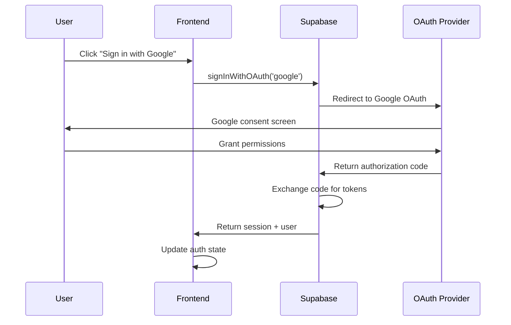
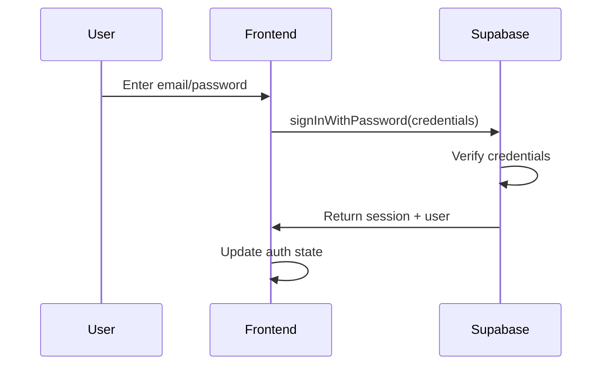
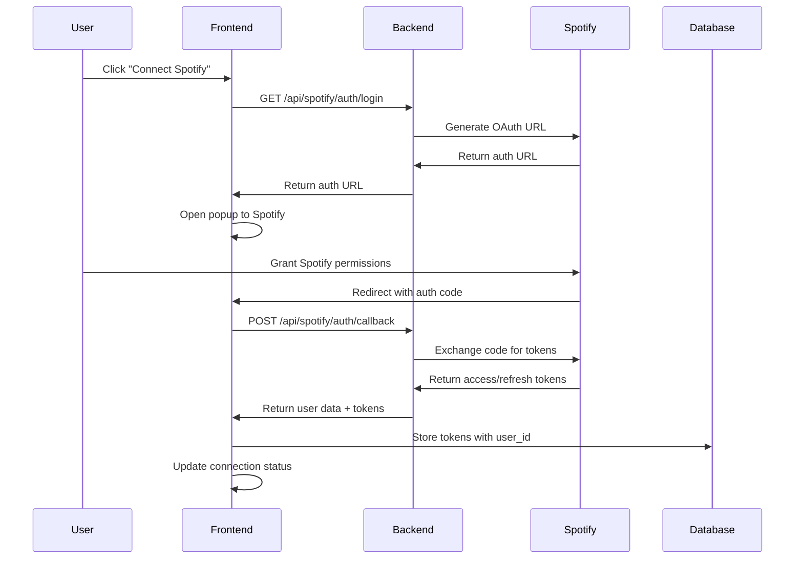
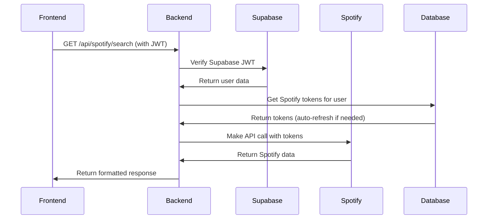

# Authentication Architecture - Bandruption Playlist Stores

## Overview

This document describes the comprehensive authentication architecture implemented for the Bandruption Playlist Stores platform. The system uses **Supabase as the primary authentication provider** with **Spotify as a linked secondary service**, following enterprise-grade security practices while maintaining the existing Spotify integration patterns.

## Architecture Design

### High-Level Flow Diagram

```
┌─────────────────┐    ┌──────────────────┐    ┌─────────────────┐
│   Supabase      │    │   Your Backend   │    │    Spotify      │
│   Auth          │    │   Server         │    │    API          │
│                 │    │                  │    │                 │
│ • Google        │───▶│ • Store Spotify  │───▶│ • Premium Check │
│ • Facebook      │    │   tokens in DB   │    │ • User Data     │
│ • Discord       │    │ • Proxy all      │    │ • Playlists     │
│ • Email/Pass    │    │   Spotify calls  │    │ • Web Playback  │
│ • Identity      │    │ • RLS policies   │    │                 │
│   Linking       │    │ • Auth middleware│    │                 │
└─────────────────┘    └──────────────────┘    └─────────────────┘
```

### Core Principles

1. **Primary Authentication**: Supabase handles all user authentication and session management
2. **Secondary Service Linking**: Spotify is linked after primary authentication
3. **Zero Trust Backend**: All API calls require Supabase JWT verification
4. **Preserved Integration**: Existing Spotify proxy patterns maintained
5. **Enterprise Security**: Built-in RLS, MFA support, and OAuth security

## Implementation Components

### 1. Frontend Authentication Layer

#### Primary Auth Context (`AuthContext.tsx`)
```typescript
interface AuthContextType {
  user: User | null;
  session: Session | null;
  loading: boolean;
  signInWithOAuth: (provider: 'google' | 'facebook' | 'discord') => Promise<void>;
  signInWithEmail: (email: string, password: string) => Promise<{error?: AuthError}>;
  signUpWithEmail: (email: string, password: string) => Promise<{error?: AuthError}>;
  signOut: () => Promise<void>;
}
```

**Key Features:**
- Supabase session management
- OAuth provider integration
- Email/password authentication
- Automatic session refresh
- Cross-tab synchronization

#### Spotify Linking Layer (`useSpotifyLinking.ts`)
```typescript
interface SpotifyLinkingHook {
  isLinking: boolean;
  error: string | null;
  linkSpotifyAccount: () => Promise<{success: boolean; error?: string}>;
  checkSpotifyLinkStatus: () => Promise<boolean>;
  unlinkSpotifyAccount: () => Promise<{success: boolean; error?: string}>;
}
```

**Key Features:**
- Links Spotify to authenticated Supabase user
- Stores tokens in database with user association
- Preserves existing popup-based OAuth flow
- Automatic token refresh handling

### 2. Backend Authentication Architecture

#### Supabase Auth Middleware
```typescript
const getSupabaseUser = async (req: any, res: any, next: any) => {
  const token = req.headers.authorization?.replace('Bearer ', '');
  const { data: { user }, error } = await supabase.auth.getUser(token);
  
  if (error || !user) {
    return res.status(401).json({ error: 'Invalid or expired token' });
  }
  
  req.user = user;
  next();
};
```

#### Spotify Token Management
```typescript
const getSpotifyTokensForUser = async (userId: string) => {
  // Fetch from database
  const { data } = await supabase
    .from('spotify_tokens')
    .select('*')
    .eq('user_id', userId)
    .single();

  // Auto-refresh if expired
  if (tokenExpired(data.expires_at)) {
    return await refreshSpotifyTokens(data);
  }
  
  return data;
};
```

### 3. Database Schema

#### Core Tables

**auth.users** (Supabase managed)
- Primary user records
- OAuth identity linking
- Session management

**public.users** (Application extended)
```sql
CREATE TABLE public.users (
  id UUID REFERENCES auth.users(id) PRIMARY KEY,
  email TEXT NOT NULL,
  username TEXT NOT NULL,
  avatar_url TEXT,
  spotify_connected BOOLEAN DEFAULT false,
  spotify_display_name TEXT,
  spotify_image_url TEXT,
  spotify_user_id TEXT,
  created_at TIMESTAMP WITH TIME ZONE DEFAULT NOW(),
  updated_at TIMESTAMP WITH TIME ZONE DEFAULT NOW()
);
```

**public.spotify_tokens** (Spotify integration)
```sql
CREATE TABLE public.spotify_tokens (
  id UUID DEFAULT uuid_generate_v4() PRIMARY KEY,
  user_id UUID REFERENCES public.users(id) ON DELETE CASCADE,
  access_token TEXT NOT NULL,
  refresh_token TEXT NOT NULL,
  spotify_user_id TEXT,
  expires_at TIMESTAMP WITH TIME ZONE NOT NULL,
  created_at TIMESTAMP WITH TIME ZONE DEFAULT NOW(),
  updated_at TIMESTAMP WITH TIME ZONE DEFAULT NOW()
);
```

#### Row Level Security (RLS)

```sql
-- Users can only access their own tokens
CREATE POLICY "Users can access own spotify tokens" 
ON public.spotify_tokens
FOR ALL USING (auth.uid() = user_id);

-- Users can read/update their own profile
CREATE POLICY "Users can access own profile" 
ON public.users
FOR ALL USING (auth.uid() = id);
```

## Authentication Flows

### 1. Primary Authentication Flow

#### OAuth Sign-In (Google/Facebook/Discord)


#### Email/Password Sign-In


### 2. Spotify Linking Flow

#### Link Spotify Account


### 3. API Request Flow

#### Authenticated Spotify API Call


## Security Features

### 1. Authentication Security

- **JWT Verification**: All API endpoints verify Supabase JWTs
- **Automatic Token Refresh**: Handles expired Spotify tokens transparently
- **Secure Token Storage**: Spotify tokens encrypted in database
- **CORS Protection**: Configured for allowed origins only
- **Rate Limiting**: Built into Supabase by default

### 2. Authorization Security

- **Row Level Security**: Database-level access controls
- **User Isolation**: Users can only access their own data
- **API Scoping**: Spotify tokens limited to required scopes
- **Session Management**: Automatic session cleanup and rotation

### 3. Data Protection

- **Environment Variables**: All secrets stored securely
- **Database Encryption**: Supabase provides encryption at rest
- **Transport Security**: HTTPS enforced for all communications
- **Token Rotation**: Automatic refresh token rotation

## Testing Architecture

### 1. Test Coverage

The implementation includes comprehensive testing across all layers:

#### Frontend Tests (83 tests)
- **Unit Tests**: Individual component testing
- **Integration Tests**: Auth flow testing  
- **Hook Tests**: Custom hook behavior
- **Context Tests**: State management testing

#### Backend Tests (8 tests)
- **API Endpoint Tests**: Route functionality
- **Authentication Tests**: Middleware validation
- **Integration Tests**: End-to-end API flows
- **Import Tests**: Module resolution validation

### 2. Test Structure

#### Frontend Test Examples
```typescript
// Auth context testing
describe('AuthContext', () => {
  it('should handle OAuth sign-in', async () => {
    const { result } = renderHook(() => useAuth());
    await act(async () => {
      await result.current.signInWithOAuth('google');
    });
    expect(result.current.user).toBeTruthy();
  });
});

// Spotify linking tests
describe('useSpotifyLinking', () => {
  it('should link Spotify account after auth', async () => {
    const { result } = renderHook(() => useSpotifyLinking());
    const linkResult = await result.current.linkSpotifyAccount();
    expect(linkResult.success).toBe(true);
  });
});
```

#### Backend Test Examples
```typescript
// Auth middleware tests
describe('Supabase Auth Middleware', () => {
  it('should reject requests without valid JWT', async () => {
    const response = await request(app)
      .get('/api/spotify/me')
      .expect(401);
    expect(response.body.error).toContain('Authorization token required');
  });
});

// Integration tests
describe('Spotify API Integration', () => {
  it('should fetch user data with valid auth', async () => {
    const response = await authenticatedRequest()
      .get('/api/spotify/me')
      .expect(200);
    expect(response.body).toHaveProperty('id');
  });
});
```

### 3. Test Environment Setup

#### Mock Configurations
```typescript
// Supabase test client
const createSupabaseClient = () => {
  if (process.env.NODE_ENV === 'test') {
    return createClient('https://mock.supabase.co', 'mock-anon-key');
  }
  return createClient(supabaseUrl, supabaseAnonKey);
};

// Spotify API mocks
jest.mock('../services/spotifyService', () => ({
  getCurrentUser: jest.fn().mockResolvedValue(mockSpotifyUser),
  search: jest.fn().mockResolvedValue(mockSearchResults),
}));
```

### 4. Testing Commands

```bash
# Run all tests
npm run test

# Run specific package tests
npm run test --filter=web
npm run test --filter=server

# Run tests with coverage
npm run test:coverage

# Watch mode for development
npm run test:watch
```

## Configuration

### 1. Environment Variables

#### Required for Production
```bash
# Supabase Configuration
SUPABASE_URL="your_supabase_project_url"
SUPABASE_ANON_KEY="your_supabase_anon_key" 
SUPABASE_SERVICE_KEY="your_supabase_service_key"

# OAuth Provider Credentials  
GOOGLE_CLIENT_ID="your_google_client_id"
GOOGLE_SECRET="your_google_secret"
FACEBOOK_CLIENT_ID="your_facebook_client_id" 
FACEBOOK_SECRET="your_facebook_secret"
DISCORD_CLIENT_ID="your_discord_client_id"
DISCORD_SECRET="your_discord_secret"

# Spotify API (for linking)
SPOTIFY_CLIENT_ID="your_spotify_client_id"
SPOTIFY_CLIENT_SECRET="your_spotify_client_secret"
```

### 2. Supabase Configuration

#### Auth Providers (`config.toml`)
```toml
[auth]
enabled = true
site_url = "http://localhost:3000"
additional_redirect_urls = ["http://localhost:3000"]

[auth.email]
enable_signup = true
double_confirm_changes = false
enable_confirmations = false

[auth.external.google]
enabled = true
client_id = "env(GOOGLE_CLIENT_ID)"
secret = "env(GOOGLE_SECRET)"

[auth.external.facebook]
enabled = true
client_id = "env(FACEBOOK_CLIENT_ID)"  
secret = "env(FACEBOOK_SECRET)"

[auth.external.discord]
enabled = true
client_id = "env(DISCORD_CLIENT_ID)"
secret = "env(DISCORD_SECRET)"
```

## Benefits Achieved

### 1. Enterprise-Grade Authentication
- ✅ **Multi-provider OAuth**: Google, Facebook, Discord, Email
- ✅ **Identity Linking**: Same email across providers automatically links
- ✅ **Session Management**: Automatic refresh and cross-tab sync
- ✅ **Security Features**: MFA support, passwordless, magic links

### 2. Preserved Spotify Integration  
- ✅ **Backend Proxy Pattern**: All Spotify calls through secure backend
- ✅ **Premium Detection**: Full access to user subscription status
- ✅ **Token Management**: Automatic refresh and secure storage
- ✅ **Web Playback SDK**: Direct browser integration maintained

### 3. Developer Experience
- ✅ **Type Safety**: Full TypeScript integration
- ✅ **Testing Coverage**: Comprehensive test suites
- ✅ **Hot Reload**: Development-friendly setup
- ✅ **Monorepo Support**: Shared types and utilities

### 4. Scalability & Maintenance
- ✅ **Database-First**: Schema-driven development
- ✅ **RLS Security**: Database-level access controls  
- ✅ **API Consistency**: Unified authentication across all endpoints
- ✅ **Future-Proof**: Easy to add new OAuth providers

## Migration Strategy

For existing users, the system supports a gradual migration:

1. **Phase 1**: Parallel systems (existing + new auth)
2. **Phase 2**: Migrate existing users to Supabase auth
3. **Phase 3**: Link existing Spotify connections  
4. **Phase 4**: Deprecate old authentication system

This architecture provides enterprise-grade authentication while preserving all existing functionality and maintaining the excellent Spotify integration patterns already established.